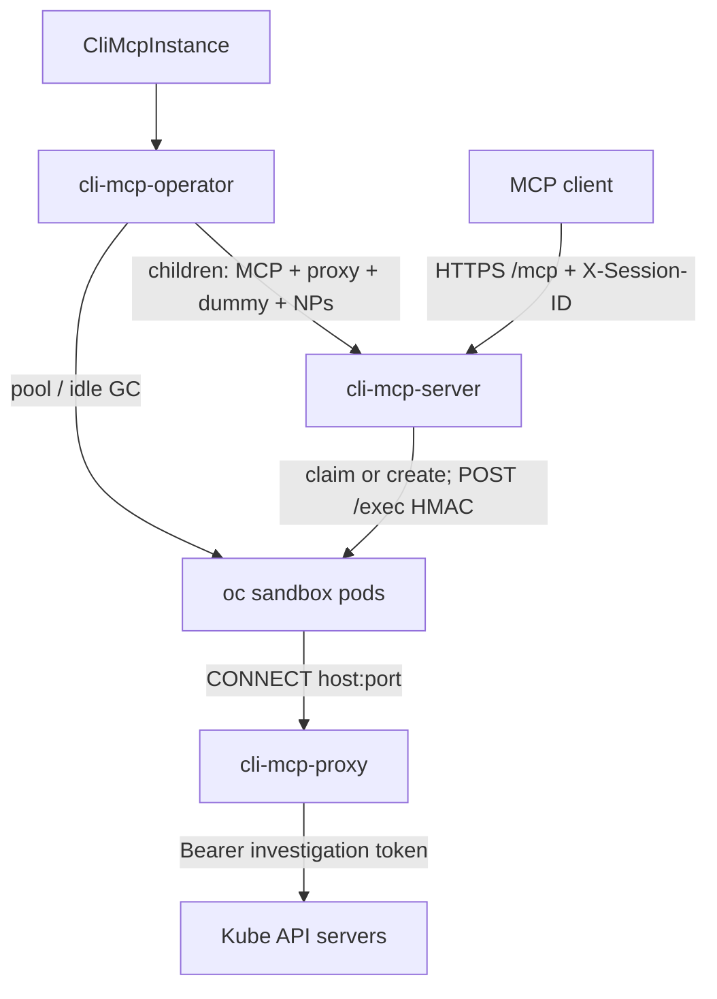

# CLI MCP — credential-isolating proxy

**Status:** Final — decisions in [credential-proxy-questions.md](credential-proxy-questions.md)

**Related:** [Questions](credential-proxy-questions.md) · [Operator HOW](cli-mcp-operator-design.md) · [As-built design](../design.md) · [Architecture overview](../architecture-overview.md) · [Umbrella analysis](../../../docs/proposals/cli-mcp-credential-proxy.md)

This is the **proxy pass** of the already-implemented CLI MCP Operator: a MITM forward proxy, dummy kubeconfig, and NetworkPolicies so a bash sandbox cannot replay a stolen token. The operator is HOW those objects are managed. `cmd/server` stays the stateless `bash` / session data plane — it does **not** reconcile the proxy stack.

This is proxy design for an **open-source Kubernetes operator**. Docs describe the product any cluster can install. First-party internal deploy is one catalog consumer, not part of the operator API.

v1 gives an MCP client a per-session `oc`/`kubectl` bash sandbox whose **effective** cluster identity is always the investigation ServiceAccount, even if the model passes `--token`, `--server`, `--kubeconfig`, or a token copied from another MCP tool.

## Overview

CLI MCP is a leader-elected operator plus a multi-replica MCP server (`cmd/server`) that creates per-session sandbox pods (`bash` over HMAC-authenticated `/exec`). As-built, the investigation kubeconfig Secret `cli-mcp-<name>-kubeconfig` is mounted into every sandbox (`pkg/session.BuildBasePodSpec`). The sandbox image includes `oc`, `kubectl`, and `curl`. There is no command allowlist. Sandbox **egress is unrestricted**. That is a token-replay path:

1. Another MCP tool, or anything the sandbox can read, can yield a projected SA token or a kubeconfig-like file. The model can feed that into the **same** bash session.
2. Client-side redaction of tool output sent back to the LLM does not stop a **same-sandbox** pipeline (`cat … | oc --token …`) where the token never returns to the client.
3. `oc --token <stolen>` or `curl -H Authorization:` talks to the API with that identity. Read-only investigation RBAC on the **mounted** kubeconfig is bypassed.

NetworkPolicy and a dummy kubeconfig are not enough on their own: `unset HTTPS_PROXY` / `--server` must fail at the network, and any `Authorization` that does reach the API must be **stripped and replaced** with the investigation token.

This pass adds a fourth image — **`cli-mcp-proxy`** — a MITM forward proxy **inspired by** claw-operator (own code, own image, own lifecycle). The operator creates one proxy Deployment per `CliMcpInstance`. Sandboxes can reach **only** that proxy. Kubernetes targets: dummy kubeconfig on the sandbox, real kubeconfig Secret on the proxy (inject). Allowlist targets: MITM + strip, no inject, no kubeconfig Secret.

**v1 scope:** one proxy per `CliMcpInstance`. Sample `oc` uses `spec.proxy.targets` with `type: kubernetes`. `type: allowlist` is implemented for OSS (domain allowlist, no inject); first-party does not have to use it. Do not share a proxy across CRs.

> **Decision (Q1):** `spec.proxy.targets[]` — `kubernetes` (optional `secretName`, default `cli-mcp-<name>-kubeconfig`) and `allowlist` (`domains`). Operator **Gets** the kubeconfig Secret; it does not mint it. See [Q1](credential-proxy-questions.md).

## Design Principles

1. **Sandbox remains the security boundary** — no bash command allowlists. Capability is image + investigation RBAC + proxy L7 + NetworkPolicy.
2. **The sandbox never holds a useful cluster credential** — dummy kubeconfig token, `automountServiceAccountToken: false`, sandbox pod SA has no RoleBindings.
3. **Strip then inject** — client `Authorization` / impersonation headers are discarded; the proxy injects the configured credential for that host. Stolen tokens in the sandbox cannot be replayed through the proxy.
4. **NetworkPolicy is what makes the proxy mandatory** — dummy kubeconfig is convenience; egress-to-proxy-only is the control. Direct API, `--server`, and `unset HTTPS_PROXY` fail closed.
5. **One proxy per MCP instance / class, shared by all sessions of that class** — not a sidecar (shared netns = bypass), not per-session (same identity anyway).
6. **Do not share a proxy across CRs** — a union allowlist would let the `oc` sandbox `CONNECT` to whatever another instance may reach. Mixing `kubernetes` + `allowlist` on **one** CR is that class’s union (allowed); first-party `oc` ships kubernetes only.
7. **Do not consume the claw-operator proxy image or vendor its package** — implement `cli-mcp-proxy` here for the features this design locked (Q10). Claw is an example, not a fork source.
8. **No namespace EgressFirewall to kube API IPs once the proxy is in place** — that EF was a no-proxy stopgap and would reopen direct API from sandbox pods.
9. **MCP stays a dumb shell proxy** — it still does not parse bash. Credential isolation is a network/identity feature, not a command filter.
10. **Fail closed** — if the proxy, dummy kubeconfig (when kubernetes targets exist), or sandbox egress are not ready, neither the operator (pool) nor the MCP (on-demand create) creates sandbox pods that could egress more freely.
11. **Operator owns instance infrastructure; MCP does not.** No ensure-loop in `cmd/server`. MCP does not watch the CR. The operator renders flags onto the MCP Deployment, including dummy ConfigMap name and proxy Service DNS.
12. **`spec.proxy.targets` is the proxy API (Q1).** Not `spec.sandbox.type`, not top-level `credentials`. `RELATED_IMAGE_PROXY`, proxy `replicas: 1` with `maxUnavailable: 0` / `maxSurge: 1` (Q11). Optional kubernetes `secretName`; default conventional Secret name.
13. **Copy existing operator patterns** — CA Secret is HMAC generate-once (never overwrite a present Secret; empty keys → `SecretKeysInvalid`). Investigation kubeconfig / routes ConfigMap / CA rotation stamps those objects’ `resourceVersion` on the **proxy** pod template (same as HMAC / krp). Overlay hash for **unassigned** sandboxes includes a fingerprint of dummy kubeconfig bytes, `ca.crt` bytes, and proxy env — not the investigation Secret’s `resourceVersion` (token rotation must not rebuild the pool). Assigned sandboxes are not deleted on spec change (Q11). `subPath` means pool pods will not pick up a rewritten dummy/CA unless recreated.
14. **Operator does not mint investigation tokens or ClusterRoles.** Admin provides the kubeconfig Secret (default name or `secretName`). The injected identity must not have `pods/exec`, secrets get, impersonate, VM mutate, or `nodes/proxy`. First-party ClusterRole YAML is a catalog-consumer follow-up, not this operator API.
15. **`cmd/server` remains runnable without the operator.** Local/dev without `--proxy-service` / `--proxy-ca-secret` / dummy ConfigMap still mounts `--kubeconfig-secret` and does not gate on NPs. In-cluster the operator always passes the proxy flags and never mounts the real Secret on sandboxes.
16. **Compatible CR updates apply immediately (Q11).** Union (add allowlist / add kubeconfig `server`) must not drain sessions or take `/mcp` down. Narrowing may break `oc` in assigned pods; bash stays. Drain the proxy on SIGTERM; do not wrap sandbox `oc`/`curl` with retries.

## Architecture / How It Works

### As-built (operator today)

```
MCP client ──HTTPS /mcp + X-Session-ID──► kube-rbac-proxy :8443
                                            │
                                            ▼
                                     cli-mcp-server
                                            │ claim or create; POST /exec (HMAC)
                                            ▼
                                     sandbox pod
                                     KUBECONFIG=/config/kubeconfig  ← real Secret
                                     SA cli-mcp-<name>-sandbox, automount false
                                            │
                                            ▼
                                     kube API (unrestricted egress)
```

Operator children already include MCP Deployment+Service, HMAC, client auth, sandbox SA, sandbox **ingress** NP (`:8090` from `component=server`). Ready does not parse the kubeconfig. Warm pool and idle GC are the operator; MCP is claim + on-demand create.

### v1 with proxy (`spec.proxy.targets`)

Sample `oc` (kubernetes only):

```yaml
apiVersion: cli-mcp.redhat.com/v1alpha1
kind: CliMcpInstance
metadata:
  name: oc
spec:
  replicas: 2
  sandbox: {}
  proxy:
    targets:
      - type: kubernetes
        # secretName omitted → Secret cli-mcp-oc-kubeconfig, key kubeconfig
```

Allowlist-only (OSS; no kubeconfig Secret, no dummy kubeconfig):

```yaml
spec:
  sandbox:
    image: quay.io/example/cli-mcp-sandbox-curl:1.2.3
  proxy:
    targets:
      - type: allowlist
        domains:
          - api.example.com
```

`spec.proxy.targets` is **required** (`MinItems: 1`). Omitting `spec.proxy` is invalid — there is no proxy-less instance after this pass. No CRD default of `[{type: kubernetes}]`. The sample CR is updated in PR 2 (today’s sample has no `spec.proxy`). Live CRs without the field are not in production; an apply of the old sample YAML fails admission.

### CRD (`spec.proxy`)

```text
spec.proxy.targets[]          required, min 1
  type                        kubernetes | allowlist
  secretName                  optional; kubernetes only; DNS-1123 label; empty → cli-mcp-<name>-kubeconfig
  domains                     allowlist only; min 1; each is host or host:port (bare host → :443)
```

CEL (in addition to the existing `metadata.name` ≤ 44):

- At most one `type: kubernetes` (keeps the default Secret name unambiguous).
- `kubernetes` must not set `domains`; `secretName` only on `kubernetes`.
- `allowlist` requires non-empty `domains` and must not set `secretName`.
- `domains` entries are literal hosts (or `host:port`). No `*.example.com`, no leading-dot suffix (`.example.com`). Invalid port → reject.

Do not add `spec.proxy.image`, `spec.proxy.replicas`, `spec.proxy.resources`, or `secretRef.key` (key stays `kubeconfig`). Mixing kubernetes + allowlist on **one** CR is that class’s union (allowed). First-party `oc` ships kubernetes only.

Operator computes the **effective** kubeconfig Secret name (`secretName` or `cli-mcp-<name>-kubeconfig`). It does not default `secretName` onto the stored spec.

```
MCP client
  │  bash + X-Session-ID
  ▼
cli-mcp-server (instance=<CR name>)
  │  POST /exec (HMAC) to sandbox :8090
  ▼
oc sandbox pods
  dummy KUBECONFIG (real server URLs, placeholder token, proxy CA)
  HTTPS_PROXY=http://cli-mcp-<name>-proxy:8080
  automountServiceAccountToken: false
  │  CONNECT api.<cluster>:6443
  ▼
cli-mcp-proxy (MITM)
  real kubeconfig Secret (tokens)
  strip Authorization + Impersonate-*
  inject investigation Bearer for that hostname:port
  │
  ▼
kube API server(s)   RBAC = investigation SA (get/list/watch, no exec)
```



Later class (**OSS `allowlist`, not first-party v1 wiring**) — same MITM binary, different CR / image / route ConfigMap / NPs:

```
CliMcpInstance curl
  spec.proxy.targets: [{type: allowlist, domains: [...]}]
  ▼
curl sandbox pods                  no dummy kubeconfig / no oc required
  HTTPS_PROXY=http://cli-mcp-curl-proxy:8080
  SSL_CERT_FILE=proxy CA
  │  CONNECT <allowed hosts>
  ▼
cli-mcp-proxy                      routes = allowlist; injector none (strip, no inject)
```

### Traffic rules the proxy enforces

On `CONNECT` and on each MITM’d request:

| Step | Behavior |
|---|---|
| Host allowlist | Exact `host:port` on CONNECT **and** on plaintext HTTP proxy requests (`OnRequest`). Operator always writes `host:port` into the route JSON (kubeconfig `server` URL; allowlist bare host → `:443`). IPs only if that `server` / `domain` is already an IP ([Q8](credential-proxy-questions.md)). Unknown host → 403, no tunnel. **Not** claw `MatchRoute`: no leading-dot suffix, no wildcards, no “bare host matches any port.” IPv6 literals use `net.JoinHostPort`. |
| MITM | **All** v1 routes MITM (kubernetes inject **and** allowlist `none`). Do **not** copy claw’s `none` without `AllowedPaths` → direct CONNECT tunnel (that would skip strip). Leaf certs signed by the proxy CA. Dummy kubeconfig (kubernetes targets) uses that CA. `curl` trusts it via `SSL_CERT_FILE` (replaces the process default bundle — correct, because sandbox TLS only goes through this MITM). |
| Strip | Before inject: `Authorization`, `X-Api-Key`, `Proxy-Authorization`, `Impersonate-User`, `Impersonate-Group`, `Impersonate-Uid`, and any `Impersonate-Extra-*`. Allowlist injects nothing after strip. Do not copy claw’s `X-Goog-Api-Key` / GCP token-vending short-circuit. |
| Inject | `kubernetes` injector maps `host:port` → token from the **real** kubeconfig, then deny path suffixes `…/exec` `…/attach` `…/portforward` `…/proxy` on the URL **path** (canonicalize with `path.Clean`; ignore query). Tests keep `logs` / `watch` / `explain` allowed ([Q9](credential-proxy-questions.md)). `allowlist` uses injector `none` (no path denylist). |
| Upstream TLS | Kubernetes routes: proxy verifies the real API server using each cluster’s original CA (`caCert` on the route). Allowlist routes: system/public CA pool. Never goproxy’s default `InsecureSkipVerify`. |

`oc --token <stolen>`, `oc --kubeconfig /workspace/leaked`, and `curl -H 'Authorization: Bearer …'` that still go through `HTTPS_PROXY` therefore authenticate as the investigation SA.

### What NetworkPolicy does (both directions)

NetworkPolicy is **not** optional. Without it the model unsets `HTTPS_PROXY` and talks to the API with any token.

| Policy | Selects | Allows |
|---|---|---|
| **Sandbox** (existing object, add Egress) | This instance’s sandbox pods | Ingress: TCP `:8090` from this instance’s MCP server pods (already shipped). **Egress:** TCP `:8080` to **this** instance’s proxy pods. **DNS is not `0.0.0.0/0`:** UDP/TCP 53 and 5353 only to `kube-system` (`namespaceSelector` `kubernetes.io/metadata.name=kube-system`) and, on OpenShift, `openshift-dns`; plus `ipBlock` `169.254.20.10/32` on UDP/TCP 53 (NodeLocal DNSCache). `curl http://1.2.3.4:53` is denied. |
| **Proxy** (new) | This instance’s proxy pods | Ingress: TCP `:8080` only from this instance’s sandbox pods. **This stops unauthorized clients** (the MCP client, other MCP servers, a later curl sandbox, a random pod in the instance namespace). **No egress rules** ([Q7](credential-proxy-questions.md)): host allowlist is L7 `MatchRoute`. |

A NetworkPolicy with `policyTypes` including `Egress` on sandbox pods makes those pods default-deny egress except the listed rules. A namespace-wide default-deny is not required.

Sandbox pods keep `dnsPolicy: ClusterFirst` (no custom `nameservers`). Direct `curl http://1.2.3.4:53` / `nc` to an attacker IP on 53/5353 is therefore denied. Lookups of `stolen.attacker.com` through **cluster** CoreDNS can still recurse to the internet (DNS labels only). Closing that would break resolving kube API hostnames. Do not allow UDP/TCP 53 to `0.0.0.0/0`.

Selectors must be **instance-specific** (`cli-mcp.redhat.com/instance=<CR name>` plus `component`), not a shared `component=sandbox` alone. Same namespace, two future instances: `oc` sandboxes must not reach the curl proxy (and vice versa). Curl = example, not v1.

Proxy pods: `cli-mcp.redhat.com/component=proxy` and the same instance label. That is the **credential proxy** Deployment, not the kube-rbac-proxy sidecar (`component=server`, container name `kube-rbac-proxy`, port `:8443`).

Proxy Service is **ClusterIP only** — no Route, NodePort, or LoadBalancer.

Do **not** add an EgressFirewall that allows sandbox pods to kube API IPs.

Sandbox NP name stays `cli-mcp-<name>-sandbox` (add Egress). Proxy NP name is `cli-mcp-<name>-proxy` ([Q2](credential-proxy-questions.md)). Ingress NP is the only proxy-use control — no CONNECT `Proxy-Authorization` ([Q6](credential-proxy-questions.md)). A create-pod principal in this namespace can mount the kubeconfig Secret and skip the proxy; extra proxy auth would not close that. Proxy NP has **no Egress** ([Q7](credential-proxy-questions.md)).

### Dummy kubeconfig

Same idea as claw `parseAndValidateKubeconfig` + `sanitizeKubeconfig` (implement here; do not import claw):

- Parse: token-only. Reject client certs, exec, auth-provider, basic auth, `tokenFile`, `certificate-authority` *file* paths (inline `certificate-authority-data` only).
- One token per server `host:port`. Contexts that share a server may differ by namespace. Different tokens for that same server → `KubeconfigInvalid` (do not last-write-wins, do not pick `current-context`). Different servers keep different tokens.
- Preserve clusters (real `server` URLs), contexts, namespaces.
- Replace every user token with `proxy-managed-token`. Clear `tokenFile`.
- Set each cluster’s `certificate-authority-data` to the **proxy CA** (not the real API CA). Clear `insecure-skip-tls-verify`.
- Real API CAs go on the proxy **route** `caCert` so the proxy can verify upstream.

Delivery: ConfigMap (no real credentials), mounted read-only at `/config` with `KUBECONFIG=/config/kubeconfig` **when a kubernetes target exists**. The real kubeconfig Secret is mounted **only** on the proxy. Do not delete the admin Secret; do not `ownerRef` it. Allowlist-only CRs skip the dummy mount; they still get `HTTPS_PROXY` and the proxy CA (`SSL_CERT_FILE`).

Today `BuildBasePodSpec` mounts Secret `cli-mcp-<name>-kubeconfig` into every sandbox, including the warm pool. With a kubernetes target that mount becomes the dummy ConfigMap. Warm pool pods get the same dummy + `HTTPS_PROXY`; they have nothing useful to steal.

Effective Secret name: `spec.proxy.targets[].secretName` if set, else `cli-mcp-<name>-kubeconfig`. Key `kubeconfig`. Dummy + routes live in ConfigMap `cli-mcp-<name>-proxy` (data `kubeconfig` + `proxy-config.json`; dummy key only with kubernetes).

Ready parses this Secret token-only ([Q4](credential-proxy-questions.md)).

### Identities (four, not two)

| Identity | Where | Purpose |
|---|---|---|
| `cli-mcp-<name>` SA | MCP server pod (+ kube-rbac-proxy sidecar) | Sandbox pods plus session auth Secret **create/delete** (no secret get/list/watch). In-cluster client. **Not** used for investigation API calls. Fail-closed GET Endpoints + sandbox NetworkPolicy. |
| Investigation tokens | Admin kubeconfig Secret on the **proxy** only (default `cli-mcp-<name>-kubeconfig`, or kubernetes `secretName`) | get/list/watch on every cluster `server` in that kubeconfig. **No `pods/exec`**, no secrets, no impersonate, no VM start/stop, no `nodes/proxy`. Operator **Gets** the Secret; it does not mint tokens or create it. |
| Sandbox pod SA `cli-mcp-<name>-sandbox` | Sandbox pods | Already shipped. **No RoleBindings. `automountServiceAccountToken: false`.** |
| Proxy pod SA `cli-mcp-<name>-proxy` | Proxy pods | Volume mounts only. **No RoleBindings. `automountServiceAccountToken: false`.** |

### Images (v1)

| Image | Binary | Role |
|---|---|---|
| `cli-mcp-operator` | `cmd/operator` | Reconcile children, pool, idle GC, Ready |
| `cli-mcp-server` | `cmd/server` | MCP `bash`, session claim/create/`/exec` |
| `cli-mcp-sandbox` | `cmd/agent` + `oc`/`kubectl`/`jq`/`yq`/`curl` | Per-session bash. Unchanged CLIs; env/mounts change |
| `cli-mcp-proxy` | `cmd/proxy` | MITM forward proxy |

CD (`.github/workflows/cd.yml` / `ci.yml`) gains a fourth matrix entry. `Containerfile.proxy` is a minimal UBI image like the server. Operator env: `RELATED_IMAGE_PROXY` next to `RELATED_IMAGE_SERVER` / `SANDBOX` / `KUBE_RBAC_PROXY`. CSV `relatedImages` gains the proxy. No `spec.proxyImage`.

### Package layout (target)

```
cmd/operator/    manager (unchanged entry; grows child builders)
cmd/server/      MCP server — flags + fail-closed GET; must not import internal/controller
cmd/agent/       sandbox agent (unchanged)
cmd/proxy/       new — flags as needed: --config, --ca-cert, --ca-key, --listen
pkg/session/     pod spec: dummy ConfigMap, proxy CA, HTTPS_PROXY, reserved proxy env, optional create gate
pkg/proxy/       MITM server + kubernetes / none injectors (inspired by claw; own code)
pkg/kubeconfig/  token-only validate, sanitize dummy, build route JSON (CRD-agnostic; operator + tests)
internal/controller/  CA generate-once, dummy+routes apply, proxy Deployment, NPs, Ready parse, pool gate
```

`pkg/session` still must not import `api/`. Sanitize/route build may live in `pkg/kubeconfig` so envtest and unit tests share it; the operator calls it. Do **not** put an infra ensure loop in `cmd/server`.

### Operator children this pass

Same reconciler, same CR. The kubeconfig Secret is **not** a child (`ownerRef` unchanged: none), whether it uses the default name or `secretName`. Names are [Q2](credential-proxy-questions.md) Option A:

| Child | Role |
|---|---|
| Secret `cli-mcp-<name>-proxy-ca` | MITM CA (`ca.crt` / `ca.key`). Generate-once like HMAC. `ownerRef` → CR. |
| ConfigMap `cli-mcp-<name>-proxy` | Routes JSON always. Dummy kubeconfig data key **only if** a kubernetes target exists. |
| SA `cli-mcp-<name>-proxy` | Proxy pods. No RoleBindings. `automountServiceAccountToken: false`. |
| Deployment `cli-mcp-<name>-proxy` | `replicas: 1`. **Set** `strategy.rollingUpdate` `maxUnavailable: 0`, `maxSurge: 1` explicitly — `NormalizeDeployment` fills 25%/25% when `RollingUpdate` is nil. Image `RELATED_IMAGE_PROXY`. Mounts CA Secret, routes ConfigMap, and the kubeconfig Secret **if** a kubernetes target exists (omit that volume until token-only parse succeeds). Stamp routes ConfigMap RV + kubeconfig Secret RV + CA RV on the pod template. SIGTERM `Shutdown`; short `preStop` sleep so Endpoints drain; `terminationGracePeriodSeconds` covering both (operator constant, not spec). Readiness/liveness TCP `:8080`. Non-root, drop ALL, RuntimeDefault seccomp (same as MCP). `emptyDir` `/tmp` for MITM leaf certs. Resources are operator constants, not spec fields. |
| Service `cli-mcp-<name>-proxy` | ClusterIP `:8080`. |
| NetworkPolicy `cli-mcp-<name>-proxy` | Proxy ingress `:8080` from this instance’s sandboxes. **`policyTypes: [Ingress]` only** — do not add `Egress` (that would default-deny proxy egress). |
| NetworkPolicy `cli-mcp-<name>-sandbox` | **Existing** — keep ingress `:8090`; **add** egress to this proxy + DNS; `policyTypes` must include `Ingress` **and** `Egress`. |

`manager-namespaced-role` already has secrets, configmaps, networkpolicies, deployments, services, serviceaccounts (ClusterRole `manager-role` is CRs + auth-delegator CRB only). CSV `relatedImages` + `RELATED_IMAGE_PROXY` on the operator Deployment.

Proxy children get `ownerRef` → CR like HMAC. The instance finalizer does not special-case them (scale MCP, delete sandboxes, then GC). Never `ownerRef` the admin kubeconfig Secret.

**Watch the effective kubeconfig Secret:** today’s `mapSecret` only enqueues `cli-mcp-<name>-{kubeconfig,tls,hmac}`. `secretName` may not match that suffix and has no `ownerRef`. Keep the suffix map; **also** enqueue every `CliMcpInstance` in that namespace whose effective kubeconfig name equals the Secret (list or field index). ConfigMap `cli-mcp-<name>-proxy` and Secret `cli-mcp-<name>-proxy-ca` already enqueue via `Owns`.

Do **not** give the MCP SA secret get. Dummy ConfigMap is mounted by kubelet into **sandbox** pods.

### Sandbox pod spec changes

Shared builder `BuildBasePodSpec` (operator pool and MCP on-demand):

| Field | This pass |
|---|---|
| Labels | Unchanged sandbox labels. Proxy pods: `component=proxy` + instance. |
| `automountServiceAccountToken` | `false` (already) |
| `serviceAccountName` | `cli-mcp-<name>-sandbox` (already) |
| kubeconfig volume | Dummy ConfigMap **`subPath`** `kubeconfig` **if** a kubernetes target exists; omit for allowlist-only |
| Proxy CA volume | Secret `cli-mcp-<name>-proxy-ca` **`subPath`** `ca.crt` for `SSL_CERT_FILE` (assigned pods must not see a later CA rewrite) |
| Env | `HTTP_PROXY`, `HTTPS_PROXY`, `http_proxy`, and `https_proxy` = `http://cli-mcp-<name>-proxy:8080` (port 8080 is an operator/MCP constant). `NO_PROXY` and `no_proxy` = `127.0.0.1,localhost,::1`. curl ignores uppercase `HTTP_PROXY` and prefers lowercase `https_proxy` / `no_proxy` over the uppercase names, so the lowercase copies are set to the same values. `SSL_CERT_FILE` (and `REQUESTS_CA_BUNDLE` to the same file if we set it). `KUBECONFIG=/config/kubeconfig` only with a kubernetes target. Reserved names (operator wins): add `HTTP_PROXY`, `HTTPS_PROXY`, `NO_PROXY`, `http_proxy`, `https_proxy`, `no_proxy`, `SSL_CERT_FILE`, `REQUESTS_CA_BUNDLE` next to `KUBECONFIG` / `HOME` / `SANDBOX_AUTH_TOKEN`. **Do not** put `.svc`, `.cluster.local`, the proxy Service name, or API hostnames in `NO_PROXY` / `no_proxy`. |
| Readiness | Unchanged: exec `curl` to `127.0.0.1:8090/health` |

`NO_PROXY` is a load-bearing footgun: a broad cluster-local list would let `oc` reach `kubernetes.default.svc` directly.

Overlay hash (today: image / resources / user env only) must also fingerprint dummy kubeconfig **data**, `ca.crt` **data**, and operator-owned proxy env. Name-only is not enough: dummy/CA object names do not change when content does, and `subPath` will not refresh running pool pods. Do **not** put the investigation kubeconfig Secret `resourceVersion` in the sandbox overlay (token rotation rolls the **proxy**, not the pool). Assigned pods are not deleted; `subPath` keeps the dummy and CA they started with ([Q11](credential-proxy-questions.md)).

`SandboxConfig` grows optional `DummyKubeconfigConfigMap`, `ProxyService`, `ProxyCASecret`. `KubeconfigSecret` remains for local/dev without proxy flags. In-cluster with proxy: dummy ConfigMap name (if kubernetes) + proxy Service + CA Secret; do not put the admin Secret name in `KubeconfigSecret`.

### Proxy configuration

Route list JSON. Kubernetes target: one route per kubeconfig cluster `server` (all clusters, not only `current-context`; CONNECT key is URL host:port, not path). That route injects the single token for that `host:port`. `CONNECT` has no context, and the sandbox token is always `proxy-managed-token`, so the proxy does not select a per-user credential. Allowlist target: one route per domain, `injector: none`. Operator always emits `domain` as `host:port`.

```json
{
  "routes": [
    {
      "domain": "api.host.example.com:6443",
      "injector": "kubernetes",
      "kubeconfigPath": "/etc/kube/config",
      "caCert": "<base64 PEM of real API CA>"
    }
  ]
}
```

v1 ConfigMap contains whatever `spec.proxy.targets` expands to. The binary stays route-list driven.

Real kubeconfig (kubernetes target): admin-provided Secret (GitOps, External Secrets, or `kubectl`) at the **effective** name (`secretName` or `cli-mcp-<name>-kubeconfig`). Cluster admin provisions investigation SAs and tokens; this operator does not mint tokens.

**CA:** generate-once P-256 ECDSA, IsCA, KeyUsageCertSign (same idea as claw’s MITM CA; CN/Org = CLI MCP). If the Secret is deleted, recreate (new CA) and roll proxy + rewrite dummy; hash-rebuild unassigned sandboxes. If the Secret exists with empty keys, `SecretKeysInvalid` — do not fill in (same as HMAC). No automatic rotation. Break-glass: delete CA Secret + dummy ConfigMap, bounce proxy, idle-GC assigned sandboxes.

Proxy mounts of routes/CA/kubeconfig may be full volumes: the process reads them **once at start**. Kubelet file updates in a still-running proxy pod are ignored until the RV-stamp roll. Sandbox dummy/CA **must** be `subPath` because `oc`/`curl` re-read files from disk.

**Rotation of investigation tokens:** watch/enqueue on the **effective** kubeconfig Secret name. Rewrite dummy + routes only when dummy/route **bytes** change (avoid a no-op ConfigMap update that would hash-rebuild the pool). Stamp that Secret’s `resourceVersion` **and** the routes ConfigMap RV on the proxy Deployment so kube rolls the proxy. `maxUnavailable: 0` / `maxSurge: 1`. SIGTERM `Shutdown` + short `preStop`. Do not add Reloader. Do not inotify-reload kubeconfig/CA. No sandbox retry wrapper.

### MCP flags (in-cluster vs local)

The operator **renders Deployment args**. MCP does not watch the CR.

| Flag | In-cluster (operator) | Local `cmd/server` |
|---|---|---|
| `--kubeconfig-secret` | **not passed** — real Secret is not a sandbox mount | optional; if set and proxy flags omitted, today’s mount (tests / kind without proxy) |
| `--dummy-kubeconfig-configmap` | `cli-mcp-<name>-proxy` **when** a kubernetes target exists; omit for allowlist-only | omit ⇒ no dummy |
| `--proxy-service` | always `cli-mcp-<name>-proxy` (HTTPS_PROXY host; port 8080 is code, not a flag) | omit ⇒ no `HTTPS_PROXY`, no fail-closed GET |
| `--proxy-ca-secret` | always `cli-mcp-<name>-proxy-ca` when `--proxy-service` is set | omit with `--proxy-service` unset |
| `--instance-name`, `--namespace`, `--sandbox-service-account`, overlay flags | unchanged | unchanged |

Sandbox NP name for the fail-closed GET is derived from `--instance-name` as `cli-mcp-<name>-sandbox` (no extra flag).

`--kubeconfig` stays the MCP process’s client-go config (empty = in-cluster). It is not the investigation kubeconfig.

`NewSessionManager`: in-cluster (proxy flags set) must not require `KubeconfigSecret`. Local without proxy flags still requires `KubeconfigSecret`. Proxy flags are `--proxy-service` + `--proxy-ca-secret` (and dummy CM when kubernetes).

### Ready (this pass)

Operator Q15 `Ready` **plus**:

1. If a kubernetes target exists: token-only parse of the **effective** kubeconfig Secret ([Q4](credential-proxy-questions.md)). Allowlist-only: skip this Secret (do **not** require `cli-mcp-<name>-kubeconfig`). Missing object → `SecretsNotFound`. Empty key → `SecretKeysInvalid`. Parse/validate failure → `KubeconfigInvalid` (new reason constant on `api/v1alpha1`). Do not write dummy data / kubernetes routes / the kubeconfig volume on the proxy until parse succeeds.
2. CA Secret present with non-empty `ca.crt`/`ca.key` (generate-once; empty → `SecretKeysInvalid`).
3. Routes ConfigMap applied (dummy data key only with kubernetes); proxy SA/Deployment/Service/NPs applied; sandbox NP has Egress (`policyTypes` includes `Egress`).
4. Proxy Deployment Available (ready replicas, including TCP `:8080` probe).
5. Warm-pool clause unchanged, but pool pods are not created until the proxy gate in [Q5](credential-proxy-questions.md) passes (so first Ready with `warmPoolSize > 0` waits on proxy endpoints too).

HMAC, TLS (generic Kubernetes), MCP Deployment Available, auth-delegator, and the existing child list stay. Add proxy SA/Deployment/Service/NP and the routes ConfigMap to `missingChildren`.

No separate `ProxyReady` condition. Session-safe proxy rollout is [Q11](credential-proxy-questions.md) (not a Ready split).

### Fail-closed (two writers)

Operator does not create unassigned pods until routes ConfigMap (dummy key when kubernetes) + sandbox Egress + proxy NP + proxy Service Ready endpoints (`subsets[].addresses`, not `notReadyAddresses`). Overlay/hash rebuild waits on the same gate.

MCP on-demand create (and claim of unassigned) GETs corev1 **Endpoints** of `--proxy-service` (ready addresses) and GETs NetworkPolicy `cli-mcp-<instance>-sandbox` (`policyTypes` must include Egress). Flags `--proxy-service` / `--proxy-ca-secret` / `--dummy-kubeconfig-configmap` (conventional names; not spec fields). Short TTL cache. Already-assigned session pods are not blocked (bash continues; `oc` fails closed at CONNECT if the proxy is down). Local without those flags does not gate.

v1 uses the Endpoints API (same name as the Service), not EndpointSlices — extra RBAC and a Q5 change.

MCP Role: `get` on `endpoints` (core) and `networkpolicies` (`networking.k8s.io`); still no secret get.

### What does not change

- Single MCP tool: `bash`. No command filter.
- `X-Session-ID`, HMAC `/exec`, warm pool, idle GC, `DELETE /sessions/{id}`.
- MCP does not watch the CR. Sessions are not CRs.
- Namespace-pinned `exec` / file forensics, if needed, stay on a **different** tool. This proxy does not provide `oc exec`.
- Client-side data masking is still useful for tokens that **do** return to the LLM; it is not a replay control.
- Client auth (kube-rbac-proxy, `climcpinstances/mcp`, `cli-mcp-auth-delegator`) is unchanged.

## Core Concepts

| Concept | Role |
|---|---|
| **Instance / class** | One `CliMcpInstance` = one MCP Deployment + one sandbox image + one proxy + one NP set. Sample `oc` is kubernetes-only; a curl instance is another CR with `type: allowlist`. |
| **Dummy kubeconfig** | What `oc`/`kubectl` read in the sandbox when a kubernetes target exists. Real hosts, fake token, proxy CA. |
| **Real kubeconfig** | Admin Secret (default name or kubernetes `secretName`). Tokens + real API CAs. Proxy only. Token-only auth. Operator Gets it; does not mint it. |
| **MITM forward proxy** | `HTTPS_PROXY` + CONNECT. Clients keep real hostnames. A kube-API reverse proxy would not extend to a later non-kube class. |
| **Strip-then-inject** | Stolen `Authorization` cannot survive the hop to the API. |
| **Proxy ingress NP** | Only this instance’s sandbox pods may use the proxy. |
| **Sandbox egress NP** | Sandboxes cannot skip the proxy. |
| **Investigation RBAC** | Last line if injection works as designed: even “successful” API calls are view-only, no exec. Not an operator-managed ClusterRole. |

## Implementation Plan

Do not execute the old MCP-ensure-loop phases. This is a **new** plan for proxy children on the existing operator. The MCP is not in production; the cutover PR **will** break in-cluster `oc` that relied on a real kubeconfig mount — that is the point. Local `cmd/server` without proxy flags keeps the old mount.

**Assigned pods at cutover are not retrofitted.** They keep the admin Secret mount and no `HTTPS_PROXY` until idle-GC / `DELETE`. Adding sandbox Egress then blocks their direct API (they also cannot use the proxy without env). Do not roll this onto a live first-party instance that still has sessions. Unassigned pool pods hash-rebuild onto dummy + proxy env.

A **phase is a milestone**. Code phases: exactly one PR. Do not merge the proxy binary with the operator cutover (different review). Do not split labels / flags / NPs into tiny PRs.

### Testing (all code phases)

Same bar as the operator design: cover this phase with cheap automated tests; defer only when a later phase is the natural home; skip only what is impractical and say so. Kind e2e isolation (unset proxy / stolen token / throwaway pod cannot CONNECT) waits until the cutover exists. `kubeconfig=unused` fixtures must become a minimal token-only kubeconfig when Ready starts parsing ([Q4](credential-proxy-questions.md)).

**Coverage check (required on every code PR):** (1) practical tests for this diff, (2) what was deferred and why, (3) what was skipped as not practical.

### Phase 0 — Decisions — **done**

Walked [credential-proxy-questions.md](credential-proxy-questions.md). This document is `Final`. Implement the PRs below.

### PR 1 — Proxy binary in this repo

Additive. Operator and sandboxes unchanged (still mount the real Secret).

- `cmd/proxy` + `pkg/proxy` + `pkg/kubeconfig`: MITM CONNECT **and** plaintext HTTP `OnRequest`, route JSON with exact `host:port`, strip-then-inject, kubernetes injector, `none` for allowlist (**always MITM**, never claw’s direct tunnel), Q9 denylist on kubernetes routes, Q8 literal match, upstream TLS verify, token-only validate, sanitize dummy kubeconfig. **Inspired by claw; do not vendor `claw-operator/internal/proxy`.** No `bearer`, gateway, Slack, GCP, oauth2, suffix-domain match, `AllowedPaths` allowlist.
- Unit tests: route match (host:port only; bare host must not match another port; suffix/wildcard rejected), unknown host CONNECT rejected (including raw IPs unless the route is an IP), plaintext HTTP to an unknown host 403, Authorization stripped and replaced, token-only rejection matrix, sanitize swaps CA + dummy token, denylist vs `logs`/`watch`, `none` MITMs (CONNECT is not a raw tunnel).
- `Containerfile.proxy`, `make build-proxy` / image target, CI/CD matrix entry. Do **not** require the operator to set `RELATED_IMAGE_PROXY` yet (image may publish unused).
- **Verify:** `go test ./pkg/proxy/... ./pkg/kubeconfig/...`; local CONNECT to a fake API with dummy vs real token.
- **Out of this PR:** operator children, `pkg/session` mount change, MCP Role, Ready parse.

### PR 2 — Operator children + sandbox contract (cutover)

Depends on PR 1. **Breaks** in-cluster sandbox `oc` without the proxy. Leaves `/mcp` bash working. Kind e2e `kubeconfig=unused` must become a minimal token-only kubeconfig.

- Operator: `spec.proxy.targets` required; CEL above; CA generate-once; parse **effective** kubeconfig Secret when a kubernetes target exists; dummy+routes ConfigMap; proxy SA/Deployment/Service/NPs; sandbox NP gains Egress + DNS; unmount real Secret from `BuildBasePodSpec`; dummy/CA **`subPath`**; `RELATED_IMAGE_PROXY`; stamp routes ConfigMap + kubeconfig + CA RVs; proxy `RollingUpdate` `maxUnavailable: 0` / `maxSurge: 1` (do not leave `RollingUpdate` nil); SIGTERM drain; overlay fingerprint includes dummy/`ca.crt`/proxy env; watch effective Secret name; pool gate ([Q5](credential-proxy-questions.md)); Ready ([Q4](credential-proxy-questions.md)); sample CR gains kubernetes target; `poolSandboxConfig` must not mount the admin Secret.
- MCP flags: `--dummy-kubeconfig-configmap`, `--proxy-service`, `--proxy-ca-secret`; stop passing `--kubeconfig-secret` in-cluster; reserved proxy env; fail-closed GET Endpoints + NP; MCP Role get endpoints + networkpolicies (still no secret get).
- Local without proxy flags: still mount `--kubeconfig-secret` (no gate).
- **Test tips:** envtest for children, `KubeconfigInvalid`, HMAC-like CA generate-once, NP selectors cannot match another instance, sandbox DNS egress is kube-system / openshift-dns / `169.254.20.10` not `0.0.0.0/0` on 53, pool does not create before proxy endpoints, MCP Role verbs, `secretName` watch enqueues, overlay hash does not change on token-only Secret RV, `NormalizeDeployment` does not reset proxy surge. `pkg/session` golden pod spec (dummy volume, env, automount, reserved env, allowlist-only omits kubeconfig). Update Kind Ready fixture to a minimal token-only kubeconfig.
- **Done when:** a CR with a valid token-only kubeconfig gets dummy + proxy + egress lock, goes Ready, and sandbox pods do not mount the admin Secret. An allowlist-only CR goes Ready with no kubeconfig Secret and no dummy mount.
- **Out of this PR:** first-party GitOps investigation ClusterRole; production MCP client wiring; Kind isolation of `unset HTTPS_PROXY` if the sandbox image + real API are too heavy (then PR 3).

### PR 3 — Kind isolation e2e

Depends on PR 2. Load proxy image. Assert: sandbox cannot reach API IPs with `unset HTTPS_PROXY` / `oc --server`; `oc --token` / `curl -H Authorization` through the proxy still only has investigation RBAC; a throwaway pod in the namespace cannot CONNECT to the proxy Service; a second instance’s sandbox cannot use the first proxy; `curl http://<external-ip>:53` from the sandbox is denied.

Defer if Kind cannot cheaply run a fake API + MITM; say so and keep envtest/unit as the bar until it can.

### Follow-up — First-party catalog (other repo, not this operator)

Investigation ClusterRole + bindings + kubeconfig Secret contents (no `view` if it includes secrets get; no exec). Drop any leftover “sandbox has unrestricted egress” assumptions. Wire a production/stage MCP client only after PR 2/3 isolation checks pass. Not a `CliMcpInstance` API change.

## Decisions

Recorded in [credential-proxy-questions.md](credential-proxy-questions.md).

| # | Topic |
|---|---|
| [Q1](credential-proxy-questions.md) | **Decided:** `spec.proxy.targets[]` (`kubernetes` + `allowlist`; optional kubernetes `secretName`) |
| [Q2](credential-proxy-questions.md) | **Decided:** pack names (`cli-mcp-<name>-proxy` / `-proxy-ca`; sandbox NP gains Egress); CEL 44 unchanged |
| [Q3](credential-proxy-questions.md) | **Decided:** dedicated SA `cli-mcp-<name>-proxy`; no RoleBindings; automount false |
| [Q4](credential-proxy-questions.md) | **Decided:** token-only parse; `KubeconfigInvalid`; fold proxy children into `Ready` |
| [Q5](credential-proxy-questions.md) | **Decided:** operator pool gate + MCP GET Endpoints/NP; no namespace default-deny |
| [Q6](credential-proxy-questions.md) | **Decided:** NetworkPolicy only; no CONNECT basic auth |
| [Q7](credential-proxy-questions.md) | **Decided:** no proxy egress NP; L7 `MatchRoute` is the host allowlist |
| [Q8](credential-proxy-questions.md) | **Decided:** exact `host:port` only; no DNS resolve; no suffix/wildcard |
| [Q9](credential-proxy-questions.md) | **Decided:** L7 denylist (`exec`/`attach`/`portforward`/`proxy`) on kubernetes injector routes only |
| [Q10](credential-proxy-questions.md) | **Decided:** claw is inspiration; implement only features this proxy needs (no vendor) |
| [Q11](credential-proxy-questions.md) | **Decided:** compatible updates apply now; proxy drain; no sandbox retry; no generational proxy |

## Out of scope / non-goals

- Command allowlists on `bash`.
- `oc exec` / port-forward / attach through the proxy (use a namespace-pinned tool if you need that).
- Sharing the claw-operator proxy image, vendoring `claw-operator/internal/proxy`, or extracting a new common proxy repo.
- Claw `none` as a direct (non-MITM) CONNECT tunnel; claw suffix/wildcard `MatchRoute`; claw gateway/`AllowedPaths` allowlist; `bearer` / GCP / oauth2 injectors.
- EndpointSlices (v1 fail-closed uses corev1 Endpoints).
- Namespace EgressFirewall to kube API IPs **together with** the proxy.
- Per-session proxy pods or proxy sidecars.
- One shared proxy for multiple classes (union allowlist).
- First-party catalog wiring a curl CR (OSS `allowlist` type is in this pass; shipping a curl sandbox image is not).
- Mixing kubernetes + extra allowlist domains on first-party `oc` (union would widen CONNECT).
- Defaulting omitted `spec.proxy` to kubernetes (targets are required).
- DNS UDP/TCP 53 to `0.0.0.0/0` (sandbox DNS is cluster DNS namespaces + NodeLocal only).
- Blocking recursive lookups through cluster CoreDNS (needed to resolve kube API hostnames).
- Automatic proxy CA rotation (generate-once; break-glass delete).
- Reloader, or inotify reload of kubeconfig/CA inside the proxy.
- Sandbox `oc`/`curl` retry wrappers; generational proxy Services; waiting for idle before applying a union edit.
- Per-user credentials (shared investigation kubeconfig, unchanged).
- Operator-minted investigation tokens or ClusterRoles.
- Interactive stdin (`oc edit`, `oc exec -it`).
- MCP secret get/list/watch.
- An infra ensure loop in `cmd/server`.
- `spec.proxy.resources` / `spec.proxy.replicas` / `spec.proxy.image`.
